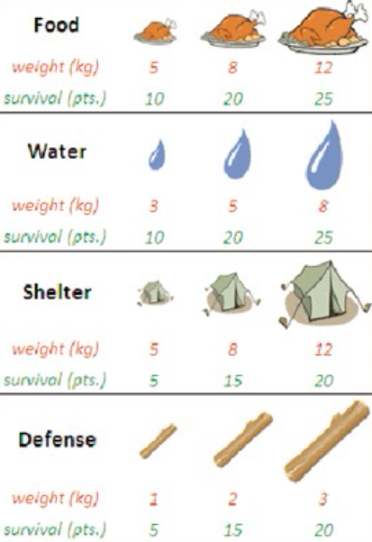

# Week 1 Puzzle: Backpack Survival

> Team: Nicolas Racchi, Manuel Nava

## Problem statement

_In a long and dangerous hiking, you have to select items to bring with you in your backpack._

<div align="center" style="padding: 25px"></div>

The backpack has a capacity of **25kg**, you must select **one item per category** and you must not overcome the total capacity.

The goal is to maximize the survival points.

---

## Our Solution

We implemented our solution with a Python script, which can be found both in the same folder as this PDF and on GitHub: [https://www.github.com/nicolas-racchi/backpack-survival](https://www.github.com/nicolas-racchi/backpack-survival).

### Requirements & Installation

We used the `ortools` [library](https://developers.google.com/optimization) made by Google. In particular, this library provides access to many different kinds of optimization solvers, such as [GLOP](https://developers.google.com/optimization/lp/glop) (Google's linear programming system), [SCIP](https://www.scipopt.org) (Solving Constraint Integer Programs) and more — with an easy to use and well documented python wrapper.

To run our solution, follow these steps:

```bash
git clone https://github.com/nicolas-racchi/backpack-survival.git
cd backpack-survival

# for Unix (optional)
virtualenv venv && source venv/bin/activate

pip i -r requirements.txt
python backpack.py
```

### Solution walk-through

1. Creation of the data model for the problem
2. Choosing the right solver
3. Declaring the variables
4. Setting the constraints
5. Optimization objective
6. The solution
7. Final numbers

#### 1. Data model

We created items with arrays defining their properties, disregarding their category. In this case we have 4 different categories with 3 items each, so a total of 12 different items.

```python
data = {}
data['points'] = [10, 20, 25, 10, 20, 25, 5, 15, 20, 5, 15, 20]
data['weights'] = [5, 8, 12, 3, 5, 8, 5, 8, 12, 1, 2, 3]
data['capacity'] = 25
data['items'] = list(range(len(data['weights'])))
data['items_per_category'] = 3
```

#### 2. Choosing the right solver

This was a shot in the dark, because we don't have any knowledge of the theory behind these solvers (yet). We found a [similar problem](https://developers.google.com/optimization/bin/multiple_knapsack) to use as a starting point. Google's documentation labels this kind of problem as [Packing](https://developers.google.com/optimization/bin/bin) and suggests the use of a mixed integer programming solver, so that's why we used the SCIP solver.

```python
solver = pywraplp.Solver.CreateSolver('SCIP')
```

#### 3. Declaring the variables

Since this is an integer problem, the variables are all integers. We created an object `x` with boolean values, so that `x[1] = 1` if the item has been put in the backpack, `0` otherwise.

```python
x = {}
for i in data['items']:
    x[i] = solver.IntVar(0, 1, 'x_%i' % (i))
```

#### 4. Setting the constraints

There are only 2 constraints for this problem:

1. Each item category must be in the backpack. This means that at least 1 every 3 items in the `items` array must have `x[i] = 1`:

```python
c = data['items_per_category']
for i in range(int(len(data['items']) / c)):
    solver.Add(sum(x[j] for j in range(i*c, i*c+c)) == 1)
```

2. the total weight must be under 25kg.

```python
solver.Add(sum(x[j] * data['weights'][j]
                for j in data['items']) <= data['capacity'])
```

#### 5. Optimization objective

The goal of the optimization is to maximize the survival points, as stated before.

```python
objective = solver.Objective()
for i in data['items']:
    objective.SetCoefficient(x[i], data['points'][i])
objective.SetMaximization()
```

#### 6. The solution

Now we have to execute the actual solution and print the results:

```python
status = solver.Solve()
if status == pywraplp.Solver.OPTIMAL:
    print("Total survival points: ", objective.Value())
    print("Items in the backpack:")
    total_weight = 0
    for i in data['items']:
        if x[i].solution_value() > 0:
            print("Item", i, " - weight: ",
                  data['weights'][i], " - points: ", data['points'][i])
            total_weight += data['weights'][i]
    print("Total weight: ", total_weight, "kg")
```

#### 7. Final numbers

By executing the script as explained above, we get the following solution:

```text
Total survival points:  75.0
Items in the backpack:
Item 1 (medium food) - weight:  8  - points:  20
Item 4 (medium water) - weight:  5  - points:  20
Item 7 (medium shelter) - weight:  8  - points:  15
Item 11 (big defense) - weight:  3  - points:  20
Total weight:  24 kg
```
